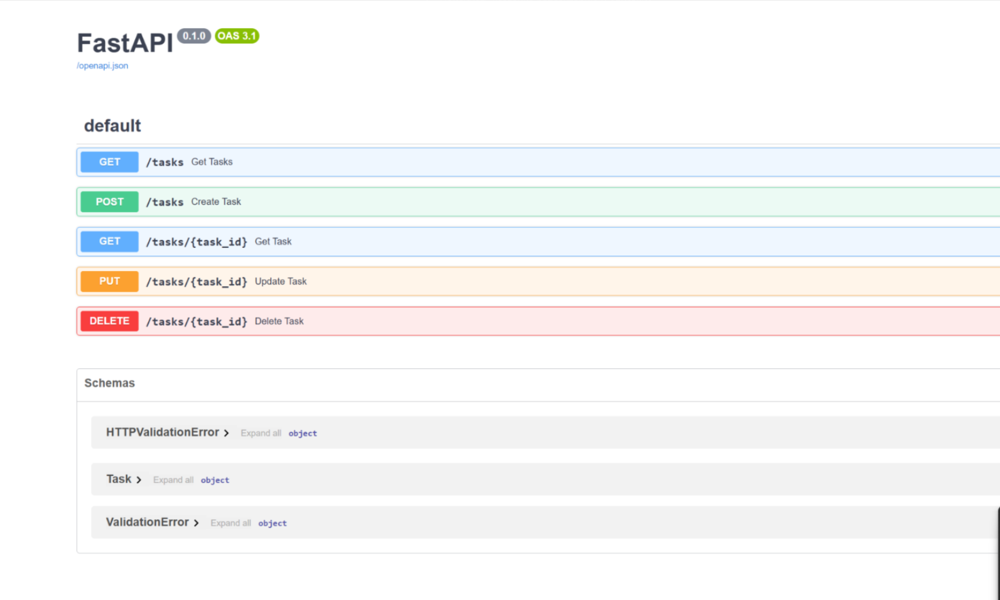
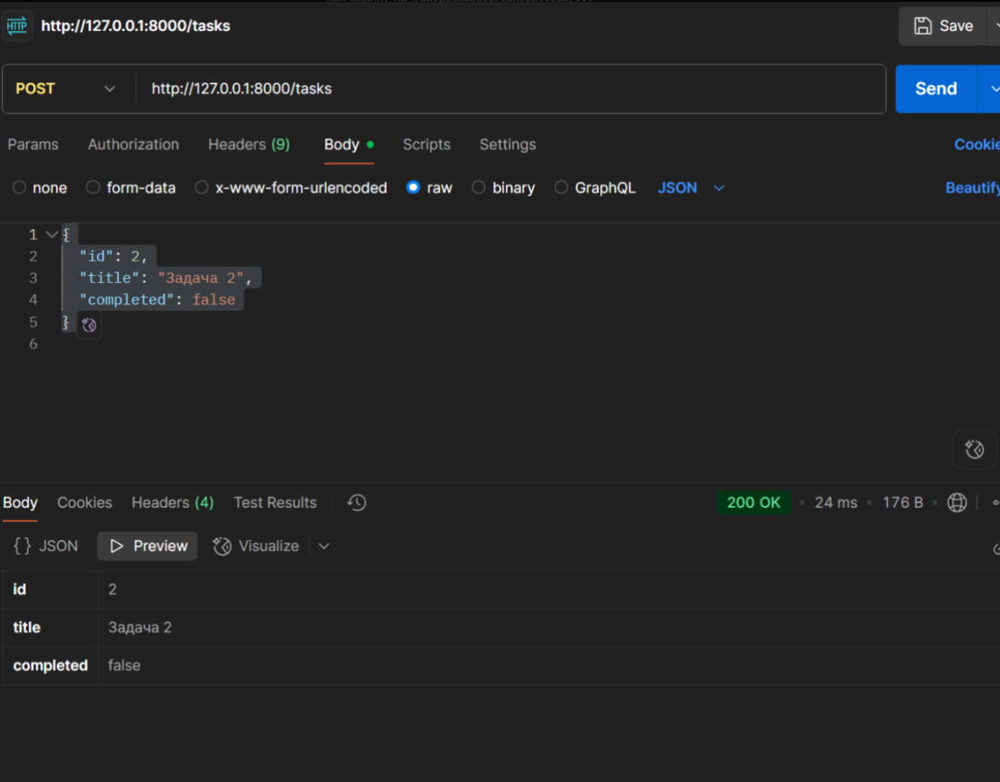
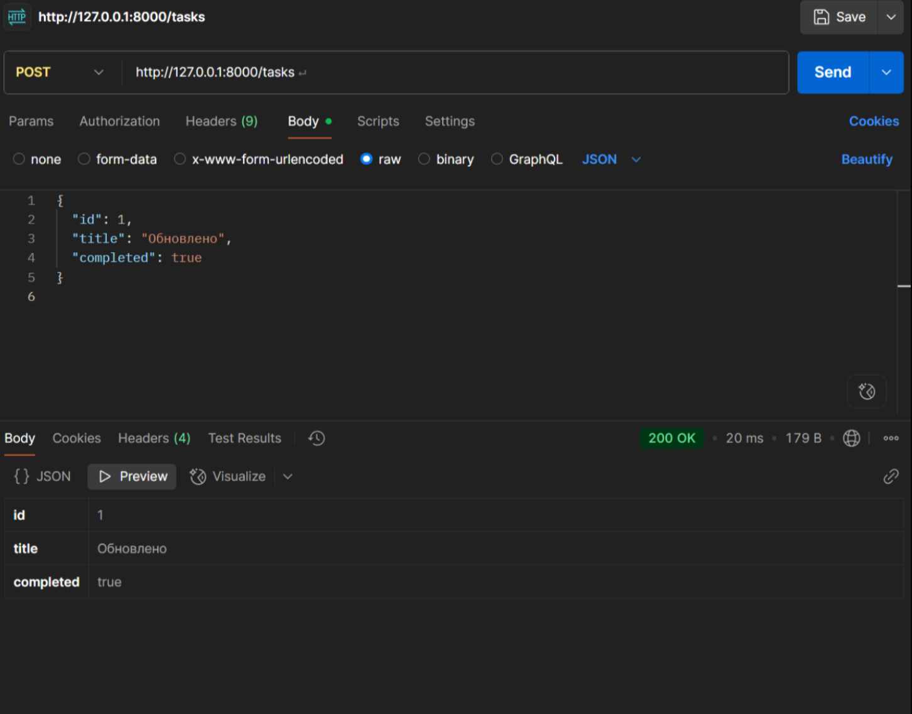
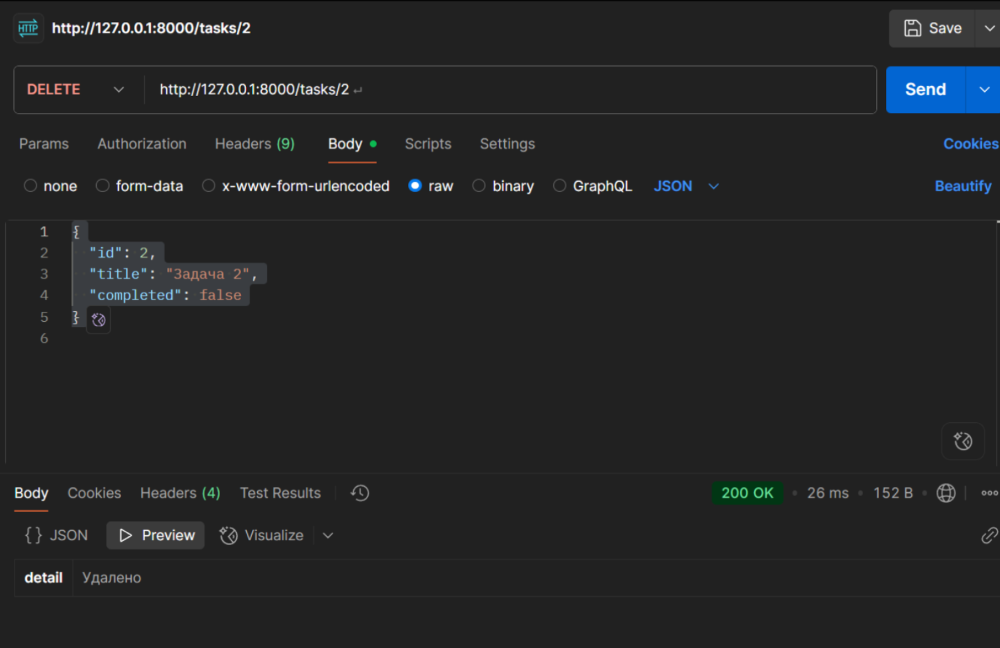
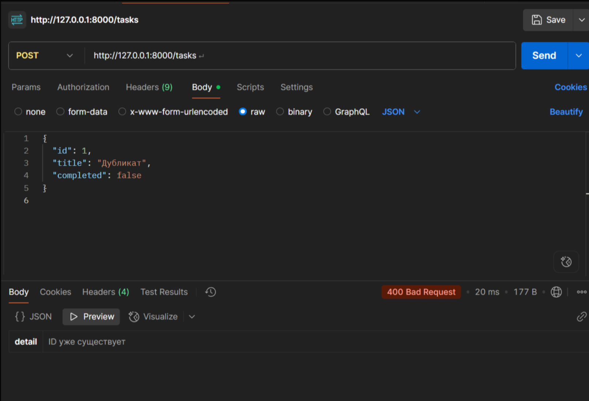
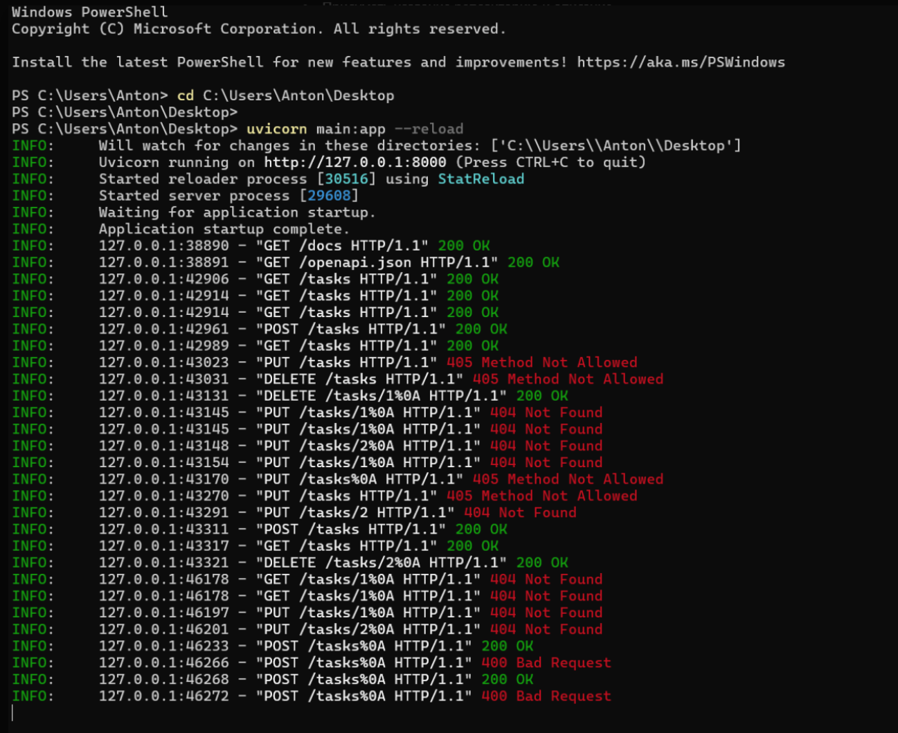

# 🧪 Мини-проект: Тестирование REST API (FastAPI + Postman)

## 📌 Описание

Небольшой учебный проект, в котором я:

- развернул API-сервер на **FastAPI**
- протестировал его вручную через **Postman**
- проверил все основные CRUD-операции

---

## ⚙️ Что реализовано

| Метод  | URL           | Назначение                 |
|--------|---------------|----------------------------|
| GET    | `/tasks`      | Получить список задач      |
| GET    | `/tasks/{id}` | Получить задачу по ID      |
| POST   | `/tasks`      | Создать новую задачу       |
| PUT    | `/tasks/{id}` | Обновить задачу            |
| DELETE | `/tasks/{id}` | Удалить задачу             |

---

## 🛠️ Технологии

- Python + FastAPI
- Postman
- Ручное тестирование
- Markdown

---

## ✅ Проверено вручную

- Успешное создание, редактирование и удаление задач
- Ошибки при дубликатах или несуществующих ID
- Проверка кодов ответа: `200 OK`, `400 Bad Request`, `404 Not Found`
- Swagger-документация
- Скриншоты в папке `/assets/screens`

---

## 📸 Скриншоты

### 🧭 Swagger UI

---

### 📤 Успешные запросы

#### POST /tasks (создание задачи)

#### PUT /tasks (обновление задачи)

#### DELETE /tasks/2 (удаление задачи)

#### GET /tasks (получение всех задач)

---

### ❌ Ошибки

#### POST /tasks (дублирующий ID)

---

### 🖥️ Сервер

#### Логи терминала при тестировании

---
## 📂 Структура
- `main.py` — код сервера
- `README.md` — описание
- `assets/` — скриншоты

---

🎯 Цель проекта
Закрепить практику работы с:

API и методами HTTP

ручным тестированием в Postman

Markdown-документацией

🎯 Проект сделал, чтобы закрепить практику работы с API, ручным тестированием и базовой документацией.
